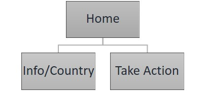

# EcoTurningPoint

#### The aim of this website is to in a simplistic way present todays challenges by using realtime data on global and on countrywise level. This will be done using data from Worldbank and connect it to Google-map. Finally I will present options on how to get involved or support different organisations working these challenges. 
------
-----

## UX(User Experience)

### Project Goal

#### The goal of this project is to build a interactive and responsive website presenting todays global challenges using data e.g. Worldbank and connect it to Googlemap.

#### The features on the website will:
- Give users the possibilty to understand todays global problems based on facts and realtime data
- Give users the possibilty to compare data on global and countrywise level
- Give users a chance to get involved in specific topics and support Aid organisation work with a topics 
- Give users a chance to contact the developer on this site through email and social media

#### I will achieve this by:
- Extract data from Worldbank, connect and present it on a Googlemap-function
- Extract data from database of trustworthy Aid organisation and present as a list with links to specific organisation
- Present link to email and social media

## User Goal

#### We expect this website to be used by the following personas
- Knowledge seeker who want to get background on todays global problems based on realtime data
- People who want to get involved and change the directions of today global challenges

The personas main goal is to find informations about today problems so that they know how they should relate, get involved and make a change. Their age span is supposed to be between 25 and 45 years old.

### User Stories

#### As a knowledge seeker I want to have a website with realtime data connected to a mapfunction and a list with Aidorganisation so that....
1.  I can find information about todays problems
2.  I can compare and get an idea on how the problems differ between countries 
3.  I can see which organisation that is involved in a specific topic

#### As a person who want to get involved and change problems on global scale I want to have a website with realtime data connected to a mapfunction and a list with Aidorganisation so that....
1.  I can find information and get an idea on the severity of a spefic problem
2.  I can compare and get an idea on how the problems differ between countries 
3.  I can support and get involved in an organisation that is works with a specific topic

### Furthermore the two user group mentoined above want to have a website with option to contact the developer of the website so that..
1. That they can get feedback to the developer

-----

### Design Choices

#### Typology

#### Wireframe

### Credit

#### Code
- Worldbank = for datacollection
- Google = Map Function

#### Image
- Users on Pexel.com 

