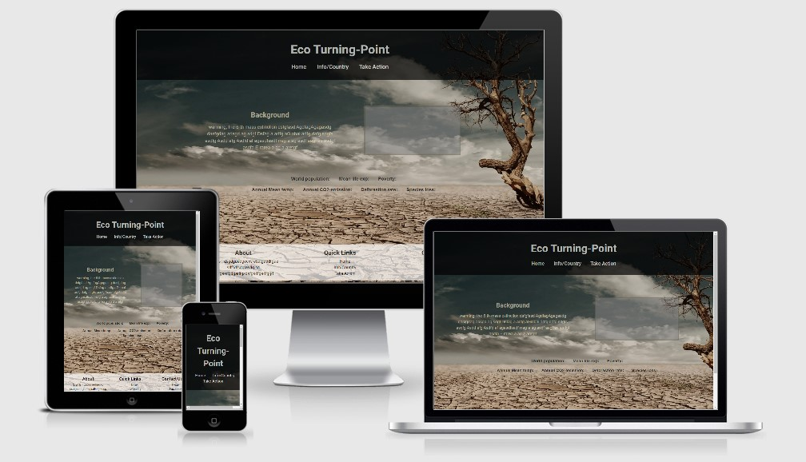

# EcoTurningPoint

#### The aim of this website is to in a simplistic way present some of todays challenges such climate change, poverty and global warming by using realtime data on global and on countrywise level. This will be done using data from Worldbank and connect it to Google-map. Finally I will present options on how to get involved or support different organisations working these challenges. 
------
-----

## UX(User Experience)

### Project Goal

#### The goal of this project is to build a interactive and responsive website presenting todays global challenges using data e.g. Worldbank and connect it to Googlemap.

#### The features on the website will:
- Give users the possibilty to understand todays global problems based on facts and realtime data
- Give users the possibilty to compare data on global and countrywise level
- Give users a chance to get involved in specific topics and support Aid organisation working with these topics 

#### I will achieve this by:
- Present Global data from Worldbank together with links describing problem such as global warming, climate change, species extinction, poverty etc.. 
- Extract data on countrylevel from Worldbank, connect and present it on a Googlemap-function
- Link to trustworthy Aid organisations 

## User Goal

#### We expect this website to be used by the following personas
- Knowledge seeker who want to get background on todays global problems based on realtime data
- People who want to get involved and change the directions of today global challenges

The personas main goal is to find informations about today problems so that they know how they should relate, get involved and make a change. Their age span is supposed to be between 25 and 45 years old.

### User Stories

#### As a knowledge seeker I want to have a website with realtime data connected to a mapfunction and links to Aidorganisations so that....
1.  I can find information about todays problems
2.  I can compare and get an idea on how the problems differ between countries 
3.  I can find and engage in aid organisations that work with challenges that concerns me

#### As a person who want to get involved and change problems on global scale I want to have a website with realtime data connected to a mapfunction and links to Aidorganisation so that....
1.  I can find information and get an idea on the severity of a specific problem
2.  I can compare and get an idea on how the problems differ between countries 
3.  I can support and get involved in an organisation that work with challenges that concerns me

-----

### Design Choices

#### Typology

#### Fonts 

#### Colors

#### Wireframe

## Technologies Used

### Languages

- HTML5
  - Used as the main mark-up language for the website content.
- CSS3
  - Used to style the individual webpages.
- Javascript
  -  Used to collecting data from Worldbank, countrycoordinates from trackCorona and adding the information to a Googlemap function in the Countrydata page.
   Data from Worldbank was also presented on global scale on the index page and text section was activated using an onscrollfunction.

### Libraries

- Bootstrap
  - Used to design a mobile-first responsive website layout.
- jQuery
  - Loaded as part of the Bootstrap CDN starter template
- Popper
  - Loaded as part of the Bootstrap CDN starter template
- Gitignore
  - Used to format code while constructing the webpage

### Tools

- Git
  - Git was used for version control by utilising the Gitpod terminal to commit to Git and push to GitHub.
- GitHub
  - Used to store, host and deploy the project files and source code after being pushed from Git.
- Gitpod
  - An online IDE linked to the GitHub repository used for the majority of the code development.
- Font-Awesome
  - Used for icons to enhance headings and add emphasis to text.
- Google fonts
  - Used for the website fonts.
- Microsoft PowerPoint
  - Used for creating mockups for e.g., Topology in readme-file
- Image Resizer
- Am I Responsive?
  - A tool for taking a quick snapshot of the responsive breakpoints of the website to visualise how the site will look on different device screen sizes in one place. The resulting screenshot is also used as the README.md logo image.
- Google Inspection Tool
  - Used for testing the design and its responsiveness
- LightHouse
  - Used for validating how well adjusted the design is in large devices as in small mobile devices
- W3Cs CCS-validator
  - Used for validating the css-code
- W3C Markup-validator
  - Used for validating the html-code

---

## Features

### Features Implemented

- Responsive mobile first design using a Bootstrap framework.
- User friendly with balanced use of image
- A Navbar with easy navigation that collapses on mobile displays
- Footer about section, quick links and socialmedia links
- Onscroll and parallax function on index page with text and pictures in a balanced porportion to allow users to interact and absorb important inforamtion
- Google map function on countrydata page with click function on country marker to open window to allow users to navigate and compare information between countries
- Links to external website explaining the background to some of the challenges we are facing today
- Links to aid organisation
- Social media links (not activated)

### Future Features

- Activate links to social media
- Add graphs and figures to Countrydata page with information on how factors at country level such poverty, emission etc.. changed over time
- Add list and form to index pages with option to search for aid organisation working in a specific field

---

## Version Control

### Version control for this repository is managed within GitHub and Gitpod using main as default branch for the project

- To start with a New Respository was created in GitHub, named OneminuteTwoTwelve
- OneminuteTwoTwelve was than linked to Gitpod pressing the green button Gitpod in the newly created Respository
- Gitpod was than used as an editor for creating the code in this project
- Python3 -m http.server was used in the Gitpod terminal to see newly made code in the webbrowser under port 8000
- New or modified files are staged using the git add . command in the Gitpod terminal
- The changes are committed using git commit -m command in the Gitpod terminal.
- The committed changes are pushed from Gitpod to GitHub using the git push command.
- The code was deployed in GitHub selecting main branch under setting in OneminuteTwoTwelve Respository

---

## Testing

- Aiming to use Lighthouse, google inspection tool, W3C validator(Html/CSS), manual testing will be presented as a pdf-protocol

### Fixed Bugs

#### I have encountered and fixed following bugs
- Unable to show google map due to 

### Credit

#### Code
- Worldbank = for datacollection
- Google = Map Function

#### Image
- Users on Pexel.com 

