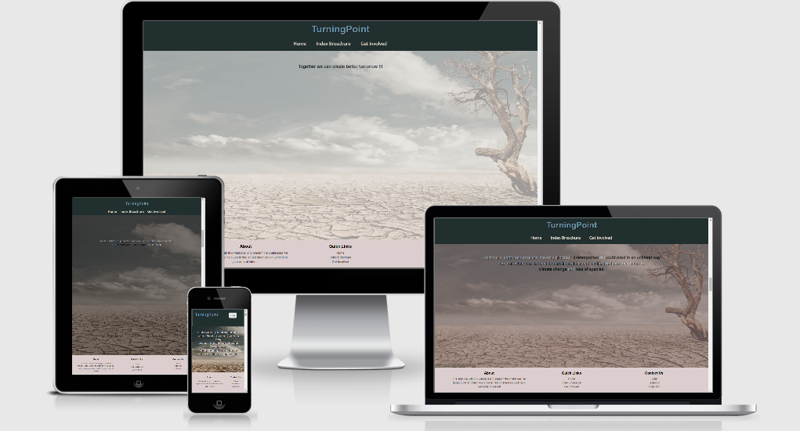
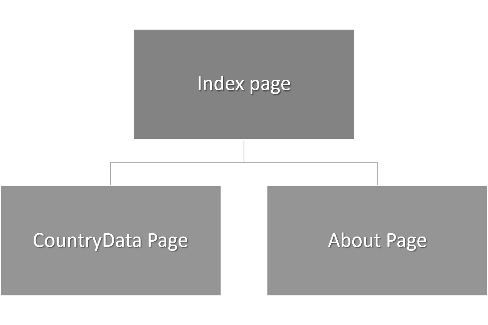

# TurningPoint

#### The aim of this website is to in a simplistic way present some of todays challenges such climate change, poverty and global warming by using realtime data on global and on countrywise level. This was done using data from Worldbank and connect it to Google-map. Finally I presented options on how to get involved or support different organisations working these challenges.The code for this project is found [here](https://github.com/GurraT/Oneminutetotwelve "Link to Oneminutetotwelve repository")
 
------
-----

## UX(User Experience)

### Project Goal

#### The goal of this project is to build a interactive and responsive website presenting todays global challenges using data e.g. Worldbank and connect it to Googlemap. Being a studentproject i don't take any responsibility in the accuracy and validity of the information extracted from external sources.

#### The features on the website will:
- Give users the possibilty to understand todays global problems based on facts and realtime data
- Give users the possibilty to compare data on global and countrywise level
- Give users a chance to get involved in specific topics and support Aid organisation working with these topics 

#### I will achieve this by:
- Present Global data from Worldbank together with links describing problem such as global warming, climate change, species extinction, poverty etc.. 
- Extract data on countrylevel from Worldbank, connect and present it on a Googlemap-function
- Present links to trustworthy Aid organisations 

## User Goal

#### I expect this website to be used by the following personas
- Knowledge seeker who want to get background on todays global problems based on realtime data
- People who want to get involved and change the directions of today global challenges

The personas main goal is to find informations about today problems so that they know how they should relate, get involved and make a change. Their age span is supposed to be between 25 and 45 years old.

### User Stories

#### As a knowledge seeker I want to have a website with realtime data connected to a mapfunction and links to Aidorganisations so that....
1.  I can find information about todays problems (see examples from index page [here](assets/documentation/severity.png "Example from indexpage"))
2.  I can compare and get an idea on how the problems differ between countries (see examples from google map function [here](assets/documentation/compare.png "Example from googlemap function"))
3.  I can find and engage in aid organisations that work with challenges that concerns me (see examples from about page [here](assets/documentation/aidorg "Example from about page"))

#### As a person who want to get involved and change problems on global scale I want to have a website with realtime data connected to a mapfunction and links to Aidorganisation so that....
1.  I can find information and get an idea on the severity of a specific problem (see examples from index page [here](assets/documentation/severity.png "Example from indexpage"))
2.  I can compare and get an idea on how the problems differ between countries (see examples from google map function [here](assets/documentation/compare.png "Example from googlemap function"))
3.  I can support and get involved in an organisation that work with challenges that concerns me  (see examples from about page [here](assets/documentation/aidorg "Example from about page"))

-----

### Design Choices

#### Typology

#### Fonts 
I used following font for my project 
- Tillium (used in Logo and in about-text and links in Footer as well as text in markerwindow in Googlemap)
- Roboto (used in infotext on indexpage and as header in Footer)
- Open Sans (used in links for navbar in header)
- Rubrik (used in for text and links in main section of about page)

#### Colors

- I focused mainly on black,white, gray colortheme to create a clear, simple and easy to read webpage,  the aim is that colorfilter in index scrollfunction, backgroundimage and googlemap function should draw attention

#### Wireframe
[Wireframe](assets/wireframe/Ecoturningpoint.pdf "Wireframe EcoTurningPoint")

## Technologies Used

### Languages

- HTML5
  - Used as the main mark-up language for the website content.
- CSS3
  - Used to style the individual webpages.
- Javascript
  -  Used for collecting data from Worldbank, countrycoordinates from trackCorona and adding the information to a Googlemap function in the Countrydata page.
   Data from Worldbank was also presented on global scale on the index page and text section was activated using an onscrollfunction.

### Libraries

- Bootstrap
  - Used to design a mobile-first responsive website layout.
- jQuery
  - Loaded as part of the Bootstrap CDN starter template
- Popper
  - Loaded as part of the Bootstrap CDN starter template
- Gitignore
  - Used to format code while constructing the webpage

### Tools

- Git
  - Git was used for version control by utilising the Gitpod terminal to commit to Git and push to GitHub.
- GitHub
  - Used to store, host and deploy the project files and source code after being pushed from Git.
- Gitpod
  - An online IDE linked to the GitHub repository used for the majority of the code development.
- Font-Awesome
  - Used for icons to enhance headings and add emphasis to text.
- Google fonts
  - Used for the website fonts.
- Microsoft PowerPoint
  - Used for creating mockups for e.g., Topology in readme-file
- Am I Responsive?
  - A tool for taking a quick snapshot of the responsive breakpoints of the website to visualise how the site will look on different device screen sizes in one place. The resulting screenshot is also used as the README.md logo image.
- Google Inspection Tool
  - Used for testing the design and its responsiveness
- LightHouse
  - Used for validating how well adjusted the design is in large devices as in small mobile devices
- W3Cs CCS-validator
  - Used for validating the css-code
- W3C Markup-validator
  - Used for validating the html-code
- freeformatter.com
    - Used for formatting/beatify CSS and Html-code
- JsHint.com
    - Used for validating javascript code
- beautifier.io
    - Used for formatting/beatify javascript code
---

## Features

### Features Implemented

- Responsive mobile first design using a Bootstrap framework.
- User friendly with balanced use of image
- A Navbar with easy navigation that collapses on mobile displays
- Footer about section, quick links and socialmedia links
- Onscroll function on index page with text and colorfilter in a balanced porportion to allow users to interact and absorb important inforamtion
- Google map function on countrydata page with click function on country marker to open window to allow users to navigate and compare information between countries
- Links to external website explaining the background to some of the challenges we are facing today
- Links to aid organisations
- Social media links (not activated)

### Future Features

- Activate links to social media
- Add graphs and figures to Countrydata page with information on how factors at country level such poverty, emission etc.. changes over time
- Add list and form to index pages with option to search for aid organisation working in a specific field
- Change background images in about page to decrease loading time and increase preformance

---

## Version Control

### Version control for this repository is managed within GitHub and Gitpod using main as default branch for the project

- To start with a New Respository was created in GitHub, named OneminuteTwoTwelve
- OneminuteTwoTwelve was than linked to Gitpod pressing the green button Gitpod in the newly created Respository
- Gitpod was than used as an editor for creating the code in this project
- Python3 -m http.server was used in the Gitpod terminal to see newly made code in the webbrowser under port 8000
- New or modified files are staged using the git add . command in the Gitpod terminal
- The changes are committed using git commit -m command in the Gitpod terminal.
- The committed changes are pushed from Gitpod to GitHub using the git push command.
- The code was deployed in GitHub selecting main branch under setting in OneminuteTwoTwelve Respository

---

## Testing

- I conducted manual testing and used Lighthouse, google inspection tool, W3C validator(Html/CSS), JsHint (javscript) for automated validatition see results below

### Manual testing
- [Protocol/Manual testing](assets/Documentation/manualtesting.pdf "Manual Testing")

### Automated testing of style.css
- [W3C CSS validation](assets/Documentation/W3CsValidation.png "Css Testing of style.css")

### Automated testing of index page
- [W3C Hmtl validation](assets/Documentation/W3CsHtmlValidation_indexpage.png "Html Testing of index page")
- [Result from lighthouse for large device](assets/Documentation/ValidationLightHouse_LargeDevice_indexpage.png "Test index page on computer through Lighthouse")
- [Result from lighthouse for mobile device](assets/Documentation/ValidationLightHouse_MobileDevice_indexpage.png "Test index page on mobile devices through Lighthouse")

### Automated testing of Countrydata page
- [W3C Hmtl validation](assets/Documentation/W3CsHtmlValidation_CountryDatapage.png "Html Testing of countrydata page")
- [Result from lighthouse for large device](assets/Documentation/ValidationLightHouse_LargeDevice_CountryDatapage.png "Test countrydata page on computer through Lighthouse")
- [Result from lighthouse for mobile device](assets/Documentation/ValidationLightHouse_MobileDevice_CountryDatapage.png "Test countrydata page on mobile devices through Lighthouse")

### Automated testing of About page
- [W3C Hmtl validation](assets/Documentation/W3CsHtmlValidation_Aboutpage.png "Html Testing of about page")
- [Result from lighthouse for large device](assets/Documentation/ValidationLightHouse_LargeDevice_Aboutpage.png "Test about page on computer through Lighthouse")
- [Result from lighthouse for mobile device](assets/Documentation/ValidationLightHouse_MobileDevice_Aboutpage.png "Test about page on mobile devices through Lighthouse")

### Automated testing of javascript code 
- [Validation through jsHint on addText.js](assets/Documentation/jsValidationAddTextScript.png "javascript validation of addText.js")
- [Validation through jsHint on worlddata.js](assets/Documentation/jsValidationWorldDataScript.png "javascript validation of worlddata.js")
- [Validation through jsHint on worldmap.js](assets/Documentation/jsValidationWorldMapScript.png "javascript validation of worldmap.js")

### The end product has been tested on following mobile devices trough chrome dev tool
- Blackberry Playbook
- Moto G4
- Galaxy S5 
- Pixel 2
- iPhone 5SE
- iPhone 6/7/8
- iPhone 6/7/8 Plus
- iPhone X
- iPad Pro
- Surface Duo 
- Galaxy Fold

### Fixed Bugs

#### I have encountered and fixed following bugs
- Unable to show google map due restriction in height of the element, solved by changing height of the div in which the function was located
- Unable to show some functions in google map due to overlaying footer element, changed the size of the footer section to avoid overlaying effects
- Depedending on device type picture and text are presented in an unsynchronized manor while scrolling through the index page, solved by removing picture and add a colorfilter incoporated in onscroll function instead of using parallax effect in css

### Known Bugs
- Coordinates from trackCorona are only used in training purpose and i take no responsibility in the accuracy of the data

---
## Credits

### Image
- For my pages I used the images listed below. I collected the images from licenced or free to use sources.

#### Indexpage
- [Bckground image](assets/img/pexels-pixabay-60013.jpg) was downloaded from [Pexel.com](https://www.pexels.com/)

#### About page
- [Smoke image](assets//img/klipartz.com_smoke.png) was downloaded from [Klipartz.com](https://www.klipartz.com/)
- [Earth image](assets//img/pexels-pixabay-355935.jpg) was downloaded from [Pexel.com](https://www.pexels.com/)
- [Fire image](assets//img/klipartz.com(4)_fire.png) was downloaded from [Klipartz.com](https://www.klipartz.com/)

### Links

- I have extracted information or linked to following pages to provide the personas using my pages with useful information

* [worldbank.org](https://api.worldbank.org/v2/country/1W/indicator/SP.POP.TOTL/?format=json&date=2010:2020&per_page=5000) api for population density at global scale
* [worldbank.org](https://api.worldbank.org/v2/en/country/1W/indicator/SP.DYN.LE00.IN?format=json&per_page=100&source=2&date=2010:2020) api for life expectancy at global scale
* [worldbank.org](https://api.worldbank.org/v2/en/country/1W/indicator/SI.POV.DDAY?format=json&per_page=100&source=2&date=2010:2020) api for poverty at global scale
* [trackcorona](https://www.trackcorona.live/api/countries) api for country coordinates
* [worldbank.org](https://api.worldbank.org/v2/country/all/indicator/SP.POP.TOTL/?format=json&date=2010:2020&per_page=5000) api for population density at country level
* [worldbank.org](https://api.worldbank.org/v2/en/country/all/indicator/SP.DYN.LE00.IN?format=json&per_page=3000&source=2&date=2010:2020) api for life expectancy at country level
* [worldbank.org](https://api.worldbank.org/v2/en/country/all/indicator/SI.POV.DDAY?format=json&per_page=3000&source=2&date=2010:2020) api for poverty at country level
* [worldbank.org](https://api.worldbank.org/v2/en/country/all/indicator/EN.ATM.CO2E.KT?format=json&per_page=20000&source=2) api for carbon emission at country level
* [Google maps](https://developers.google.com/maps/) api 
* [UN.org](https://news.un.org/en/story/2020/11/1077792) with information about starvation
* [Wikipedia.org](https://en.wikipedia.org/wiki/Climate_change) with information about climate change
* [bbc.com](https://www.bbc.com/news/business-32824770)   with information about gap between rich and poor and information about overexploitation
* [conservationandsociety.com](http://www.conservationandsociety.org/article.asp?issn=0972-4923;year=2003;volume=1;issue=1;spage=99;epage=111;aulast=Ehrenfeld)   with information about ecological consequenses
* [nasa.gov](https://climate.nasa.gov/vital-signs/global-temperature/) with information about global warming
* [cnn.com](https://edition.cnn.com/2019/08/21/americas/amazon-rainforest-fire-intl-hnk-trnd/index.html) with information about deforestion
* [wikipedia.org](https://en.wikipedia.org/wiki/History_of_chemistry) with information about the history about chemical production
* [ipcc.ch](https://www.ipcc.ch/sr15/) with information about global warming
* [wwf.org](https://www.wwf.org.uk/press-release/living-planet-report-2020) with information about ecological consequenses
* [cnn.com](https://edition.cnn.com/2020/06/01/world/sixth-mass-extinction-accelerating-intl/index.html) with information about mass extinction
* [iucnredlist.org](https://www.iucnredlist.org/) with information about species loss
* [footprintnetwork.org](https://www.footprintnetwork.org/our-work/ecological-footprint/) with information about ecological footprint
* [who.int](https://www.who.int/emergencies/partners/non-governmental-organizations) 
* [sida.se](https://cso.sida.se/) 
* [wikipedia.org](https://en.wikipedia.org/wiki/List_of_development_aid_agencies) list of aid organisation

### Deployment

The website was developed using both Gitpod for constructing code which then was pushed to GitHub,  which hosted my repository. I conducted following step to deploy my code.
- Navigated and logged in to GitHub
-  Navigated to my repository [GurraT/Oneminutetotwelve](https://github.com/GurraT/Oneminutetotwelve) 
- Opened settings.
- Scrolled down to the Section GitHub pages
- Selected master branch in the source dropdown menu
- Confirmed choice by clicking on save
#### To see the endresult and open deployed code in a webbrowser following steps were conducted 
- Navigated to my repository [GurraT/Oneminutetotwelve](https://github.com/GurraT/Oneminutetotwelve) 
- Click on the code buttom
- Selected http-adress and copied it to a webbrowser

### Inspiration

#### The Following README-file was used as an inspiration and extracting information for writing my own README-file
[Aviation-Consultancy](https://github.com/simonjvardy/Aviation-Consultancy)

### Acknowledgements

- I am grateful for the feedback i got from my mentor Narender Singh at Code Institute e.g., to make my webpage more interactive and user friendly using parallax function
- I am also grateful for the feedback I got from my second mentor Aarron Sinnot at Code Institute e.g., to make my design more clear and readable 

#### I also want to thanks following people

- Philip Magnusson who with his insight in the field and with his feedback given me valuable information regarding javascript
- Carl-Johan Svenlin, Tobias Thomsson, Fredrik Thomsson for beta-testing my webpage and given me constructive feedback on the layout
- The support I got from tutors and student care at Code institute

